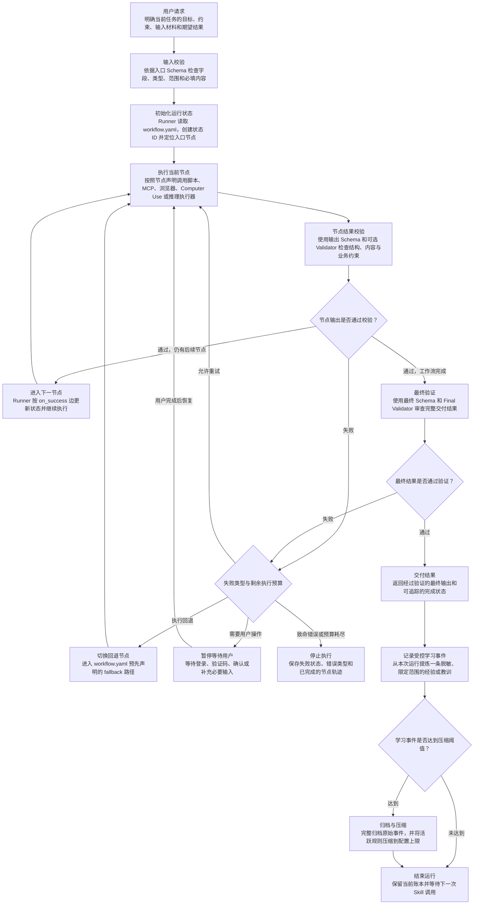

# AIALRA-SKILL-TEMPLATE

一个通用的、可执行的 Agent Skill 仓库模板；它统一每个 Skill 必须遵循的运行协议：

- 图驱动工作流：使用明确的节点和有向边定义执行步骤、先后顺序与状态转换，使每次运行都遵循同一条可检查、可追踪的工作流；
- 结构化输入输出：使用 Schema 约束初始输入、节点输出和最终结果，使 Agent、脚本与外部工具之间通过明确的数据契约协作；
- 确定性执行：将固定、重复、可计算的操作交给参数化脚本执行，并将外部工具调用和语义判断限制在节点声明的范围内；
- 失败回退：为每个节点声明超时、最大重试次数、预定义回退节点、用户等待状态和停止条件，使失败按照受控路径处理；
- 最终验证：在节点执行后校验输出，并在工作流完成前执行最终 Schema 与 Validator 检查，只有通过验证的结果才能交付；
- 受控学习：每次运行后记录一条脱敏、限定范围的经验或教训，定期压缩活跃规则并完整归档原始事件，核心规则只能经过审查、测试和版本变更后更新；
- 独立 Git：每个 Skill 使用独立仓库管理提交历史、版本、测试、发布和回滚，使其能够单独演进并保持可追溯性；

## 核心模型

### Git 仓库

Skill 是围绕一个明确任务领域组织起来的工作流、指令、Schema、脚本、验证器、测试和学习记录；每个 Skill 由本模板生成，并拥有自己的独立 Git 仓库；

采用独立仓库的原因是：

- 变更边界清晰：一个 Skill 的工作流、权限或学习规则发生变化时，不会同时改变其他 Skill；
- 版本独立：每个 Skill 可以按照自身节奏发布版本、创建标签和维护变更记录；
- 测试独立：提交只需要验证当前 Skill 的行为，失败结果和回归范围更容易定位；
- 回滚独立：某个 Skill 出现问题时，可以单独回退到稳定版本，不影响其他 Skill；
- 权限独立：不同 Skill 可以配置不同的维护者、分支保护、外部工具权限和发布策略；
- 历史可追溯：核心规则、实现代码和学习记录保存在同一条版本历史中，能够还原任意版本的完整行为；

一个仓库只包含一个 Skill，可以让触发范围和执行领域保持足够小；Agent 的执行具有概率性；当一个仓库同时承载多个任务领域时，触发判断、工具权限、状态流转和学习规则更容易互相影响；单 Skill 仓库让每次执行只面对一组明确的输入、节点、权限和输出契约；

### Catalog

Catalog 是多个 Skill 的集中注册表，通常保存 Skill 名称、仓库地址、版本、负责人、分类和发现信息；它适合统一浏览、检索、依赖治理和团队级发布管理，也会增加一个共享控制层：Skill 的发现、版本和运行仓库需要共同维护，任何结构变化都可能影响整个集合；

本模板不在单个 Skill 仓库中加入 catalog；当前目标是让每个 Skill 自包含、可独立运行和独立演进；未来需要统一浏览时，可以另建一个轻量外部注册表，仅保存仓库地址、稳定版本和必要的发现信息，不参与 Skill 的具体执行；

### Profile

Profile 是面向某类任务的可复用配置变体，例如研究型、文件生产型或工具操作型 profile；它可以为一组相似 Skill 预设章节、工具策略和操作约定，也会引入额外的继承关系和选择逻辑，使维护者需要同时理解通用模板、profile 和具体 Skill 三层规则；

本模板不设置多 profile；所有 Skill 共享同一套运行协议，具体领域行为直接写入各自的 `workflow.yaml`、Schema、执行器和验证器；这样可以从仓库内容直接确定真实行为，避免通用模板与 profile 之间出现覆盖、冲突或版本漂移；

### Agent

Agent 负责理解用户意图、准备结构化输入、调用当前节点允许的外部工具，以及完成无法脚本化的语义判断；Agent 的输出由模型生成，因此同一请求可能出现不同的推理路径；如果由 Agent 自由决定下一节点，可能产生跳过校验、改变顺序、无限重试、临时选择未声明工具或提前宣布完成等行为，执行结果也难以稳定复现；

### Runner

Runner 是仓库中的确定性状态机程序，对应 `.agents/skills/<skill-name>/scripts/runner.py`；它读取 `workflow.yaml`，为每次运行创建唯一状态，记录当前节点和已完成结果，并根据预先声明的边决定下一步；Runner 负责节点顺序、输入输出校验、超时、重试、回退、用户等待、写操作确认和最终完成条件；

Agent 每次只能处理 Runner 当前返回的节点指令，再把符合 Schema 的结果提交给 Runner；Runner 校验结果后返回下一项允许动作；这个职责边界将概率性的理解与判断限制在节点内部，将流程控制交给可重复执行的程序；

完整运行过程如下：



图中的关键术语：

- `workflow.yaml`：Skill 的工作流定义文件，声明入口节点、节点属性、成功路径、回退路径和全局执行限制；
- Schema：JSON 数据契约，用于限定输入或输出必须包含的字段、类型、取值范围和附加属性；
- Validator：Schema 之外的确定性检查程序，用于验证跨字段关系、业务规则或最终结果质量；
- 状态 ID：一次 Skill 运行的唯一标识，用于保存当前节点、重试次数、确认记录、节点结果和执行轨迹；
- `on_success`：当前节点通过验证后允许进入的下一节点；工作流完成时指向完成状态；
- `fallback`：当前节点重试耗尽或明确要求降级时进入的预定义回退节点；
- 用户等待状态：需要登录、验证码、授权确认或补充输入时使用的暂停状态，用户完成操作后由 Runner 恢复；
- Learning ledger：保存脱敏学习事件的结构化账本；原始事件在压缩前完整归档，活跃规则只保留受限的运行上下文；

## 执行器优先级

执行器优先级用于设计工作流节点；工作流作者应当选择能够可靠完成任务的最高优先级执行器，并把选择结果固定在 `workflow.yaml` 中；Runner 不会在运行时让 Agent 自由切换执行器；

1. **`script`**：适合固定、重复、可计算且能够完全参数化的机械操作，例如格式转换、字段清洗、排序、聚合和确定性文件生成；脚本通过结构化文件接收输入并写出输出，由 Runner 使用参数数组和 `shell=false` 直接执行；脚本结果仍需通过节点输出 Schema 和可选 Validator；
2. **`mcp`**：适合已经提供结构化工具名称、参数和返回值的外部能力，例如数据库查询、服务 API、文件系统连接器或业务系统操作；节点必须声明具体 action 和参数来源，Agent 只负责发起当前允许的调用并提交返回结果；涉及写入或破坏性副作用时仍需经过用户确认；
3. **`browser-dom`**：适合缺少稳定 API 或 MCP、但网页仍能通过 DOM 元素、可访问性树或语义选择器可靠操作的场景；执行应优先读取结构化页面状态、定位明确元素并保留必要证据；页面登录、动态加载和布局变化必须通过超时、停止条件和回退路径处理；
4. **`computer-use`**：适合无法通过 API、MCP 或 DOM 完成，只能依据屏幕视觉状态操作桌面应用或复杂网页的场景；这种执行方式容易受到分辨率、布局、弹窗和焦点变化影响，因此节点必须缩小操作范围并设置严格停止条件；登录、验证码、扫码、双重认证和敏感确认由用户亲自完成；
5. **`reasoning`**：适合无法通过规则或脚本确定的语义判断，例如解释歧义、比较非结构化证据、归纳结论或生成面向用户的说明；推理节点只能在声明的输入、工具、输出 Schema 和停止条件内工作；它不能自行扩大任务范围、改变工作流顺序或绕过最终验证；

## 仓库结构

当前项目包含“模板工厂仓库”和“生成后的单 Skill 仓库”两个层次；模板工厂负责维护生成器、通用运行时和回归测试；`template/` 目录中的素材经过占位符替换后，才会组成一个新的独立 Skill 仓库；

GitHub 原生支持 `<details>` 和 `<summary>`，下面的结构可以直接展开或折叠；代码块用于保持树形缩进和同行注释稳定显示；

<details open>
<summary><strong>模板工厂仓库：AIALRA-SKILL-TEMPLATE</strong></summary>

```text
AIALRA-SKILL-TEMPLATE/                                      # 模板工厂仓库根目录；维护生成协议、素材、测试和文档；
├── .git/                                                   # 当前模板工厂自身的 Git 元数据目录；不复制到新 Skill；
├── .github/                                                # 模板工厂在 GitHub 上使用的自动化配置目录；
│   ├── dependabot.yml                                      # 定期检查 GitHub Actions 依赖更新；
│   └── workflows/                                          # GitHub Actions 工作流目录；
│       └── validate.yml                                    # 验证模板、运行测试并执行敏感信息扫描；
├── docs/                                                   # 模板设计、维护和迁移文档目录；
│   ├── architecture.md                                     # 说明工作流 IR、Runner 状态机和核心锁架构；
│   ├── learning.md                                         # 说明学习事件、无损归档、压缩和晋升机制；
│   ├── maintenance.md                                      # 说明版本、发布、维护和弃用策略；
│   ├── migration-v0.2.md                                  # 说明从旧 catalog/profile 结构迁移到当前结构；
│   └── research-notes.md                                  # 记录模板设计所依据的规范与研究来源；
├── scripts/                                                # 模板工厂自身的命令行工具目录；
│   ├── check_secrets.py                                    # 扫描工作区中的常见凭据和敏感值；
│   ├── create_skill_repo.py                                # 根据 template/ 素材创建独立 Skill Git 仓库；
│   └── validate_template.py                                # 检查模板完整性并试生成临时 Skill 仓库；
├── template/                                               # 创建新 Skill 时复制和渲染的完整仓库素材目录；
│   ├── .agents/                                            # Agent Skill 的发现与运行文件目录；
│   │   └── skills/                                         # Skill 定义集合目录；生成仓库只保留一个 Skill；
│   │       └── __SKILL_NAME__/                             # Skill 名称占位目录；生成时替换为实际名称；
│   │           ├── agents/                                 # Agent 产品界面和调用提示元数据目录；
│   │           │   └── openai.yaml.tmpl                    # OpenAI/Codex 界面元数据模板；
│   │           ├── schemas/                                # 默认 JSON 输入输出契约目录；
│   │           │   ├── input.schema.json                   # 草稿入口节点的默认输入 Schema；
│   │           │   └── output.schema.json                  # 草稿完成结果的默认输出 Schema；
│   │           ├── scripts/                                # 每个 Skill 自带的确定性运行时脚本目录；
│   │           │   ├── compact.py                          # 无损归档学习事件并限制活跃规则数量；
│   │           │   ├── freeze_core.py                      # 生成或检查稳定核心的 SHA-256 清单；
│   │           │   ├── learn.py                            # 为一个完成或暂停状态记录一条脱敏经验；
│   │           │   ├── promote.py                          # 创建学习规则晋升提案；不会自动修改核心；
│   │           │   ├── runner.py                           # 执行工作流状态机并控制节点、重试、回退和完成；
│   │           │   ├── runtime_lib.py                      # 提供 Schema、路径、状态、工作流和核心锁公共函数；
│   │           │   └── validate_repo.py                    # 验证生成后的单 Skill 仓库及其学习状态；
│   │           ├── SKILL.md.tmpl                           # Skill 触发描述、执行协议和职责边界模板；
│   │           └── workflow.yaml.tmpl                      # 图驱动工作流 IR 的安全草稿模板；
│   ├── .github/                                            # 新 Skill 仓库的 GitHub 自动化素材目录；
│   │   ├── dependabot.yml                                  # 新 Skill 仓库的 Actions 依赖更新配置；
│   │   └── workflows/                                      # 新 Skill 仓库的 CI 工作流目录；
│   │       └── validate.yml                                # 验证工作流、核心锁、测试和完整 Git 历史；
│   ├── learning/                                           # 新 Skill 仓库的受控学习数据目录；
│   │   ├── archive/                                        # 完整保存已压缩批次的原始学习事件；
│   │   │   └── .gitkeep                                    # 让空归档目录能够进入初始 Git 版本；
│   │   ├── proposals/                                      # 保存待人工审查的核心晋升提案；
│   │   │   └── .gitkeep                                    # 让空提案目录能够进入初始 Git 版本；
│   │   ├── active-rules.json                               # 保存有数量上限的活跃 advisory 规则；
│   │   └── ledger.jsonl                                    # 保存尚未进入归档批次的原始学习事件；
│   ├── scripts/                                            # 新 Skill 仓库的根级验证入口目录；
│   │   ├── check_secrets.py                                # 扫描生成仓库中的常见凭据和敏感值；
│   │   └── validate.py                                     # 查找唯一 Skill 并调用其仓库验证器；
│   ├── tests/                                              # 新 Skill 仓库的默认测试目录；
│   │   └── test_runtime.py                                 # 验证草稿工作流、核心锁、Schema 和脱敏器；
│   ├── .gitignore                                          # 排除凭据、运行状态、虚拟环境和本地报告；
│   ├── .gitleaks.toml                                      # 启用 Gitleaks 默认规则扫描完整历史；
│   ├── .pre-commit-config.yaml                             # 在提交前运行仓库验证和敏感信息扫描；
│   ├── AGENTS.md.tmpl                                      # 生成仓库中的长期 Agent 维护规则模板；
│   ├── CHANGELOG.md.tmpl                                   # 新 Skill 的初始变更记录模板；
│   ├── README.md.tmpl                                      # 新 Skill 仓库的使用和维护说明模板；
│   ├── SECURITY.md.tmpl                                    # 新 Skill 仓库的安全边界和响应说明模板；
│   └── VERSION                                             # 新 Skill 仓库的初始语义版本号；
├── tests/                                                  # 模板工厂的端到端回归测试目录；
│   └── test_template_runtime.py                            # 覆盖生成、Runner、回退、核心锁、学习和安全扫描；
├── .editorconfig                                           # 统一编辑器字符集、缩进和换行规则；
├── .gitignore                                              # 排除模板工厂的本地环境、凭据和运行产物；
├── .gitleaks.toml                                          # 配置模板工厂的 Gitleaks 敏感信息扫描；
├── .pre-commit-config.yaml                                 # 配置模板验证和敏感信息提交前检查；
├── AGENTS.md                                               # 约束模板工厂维护方式和不可破坏的运行不变量；
├── CHANGELOG.md                                            # 记录模板框架各版本的新增、变更和移除内容；
├── CONTRIBUTING.md                                         # 说明修改模板时需要提供的测试和版本证据；
├── README.md                                               # 面向使用者说明模板目标、架构、结构和使用方法；
├── SECURITY.md                                             # 说明模板工厂的安全策略和凭据响应流程；
└── VERSION                                                 # 当前模板工厂的语义版本号；
```

</details>

<details>
<summary><strong>生成后的单 Skill 仓库：my-skill</strong></summary>

```text
my-skill/                                                   # 一个可以独立测试、发布和回滚的 Skill 仓库根目录；
├── .git/                                                   # 新 Skill 自己的 Git 元数据和完整版本历史；
├── .agents/                                                # Agent Skill 的发现与运行文件目录；
│   └── skills/                                             # Skill 定义目录；此仓库只包含一个子目录；
│       └── my-skill/                                       # 当前 Skill 的稳定核心目录；
│           ├── agents/                                     # Agent 产品界面和调用提示元数据目录；
│           │   └── openai.yaml                             # 当前生成器提供的 OpenAI/Codex 界面元数据；
│           ├── schemas/                                    # 节点和最终结果的 JSON 数据契约目录；
│           │   ├── input.schema.json                       # 初始入口输入 Schema；领域配置时需要替换；
│           │   └── output.schema.json                      # 最终结果输出 Schema；领域配置时需要替换；
│           ├── scripts/                                    # Skill 自带的确定性运行时脚本目录；
│           │   ├── compact.py                              # 归档学习事件并重建受限活跃规则；
│           │   ├── freeze_core.py                          # 创建或检查 .core-lock.json；
│           │   ├── learn.py                                # 从一个运行状态记录一条脱敏学习事件；
│           │   ├── promote.py                              # 创建待人工审查的核心晋升提案；
│           │   ├── runner.py                               # 执行节点状态机并返回下一项允许动作；
│           │   ├── runtime_lib.py                          # 为所有运行时脚本提供公共确定性函数；
│           │   └── validate_repo.py                        # 验证 Skill 工作流、学习状态和核心锁；
│           ├── SKILL.md                                    # 声明触发范围、执行协议、边界和学习要求；
│           └── workflow.yaml                               # 声明入口、节点、执行器、边和全局限制；
├── .github/                                                # 当前 Skill 的 GitHub 自动化配置目录；
│   ├── dependabot.yml                                      # 跟踪 GitHub Actions 依赖更新；
│   └── workflows/                                          # 当前 Skill 的 CI 工作流目录；
│       └── validate.yml                                    # 运行仓库验证、测试和完整历史扫描；
├── learning/                                               # 当前 Skill 的受控成长数据目录；
│   ├── archive/                                            # 无损保存已处理批次的完整原始事件；
│   │   └── .gitkeep                                        # 保留初始空目录；产生归档后继续保留；
│   ├── proposals/                                          # 保存尚未进入稳定核心的晋升提案；
│   │   └── .gitkeep                                        # 保留初始空目录；产生提案后继续保留；
│   ├── active-rules.json                                   # 保存注入后续节点的有限 advisory 规则；
│   └── ledger.jsonl                                        # 保存当前尚未压缩的逐次运行经验；
├── scripts/                                                # 面向维护者和 CI 的根级命令目录；
│   ├── check_secrets.py                                    # 扫描仓库当前文件中的常见敏感值；
│   └── validate.py                                         # 调用唯一 Skill 的 validate_repo.py；
├── tests/                                                  # 当前 Skill 的测试目录；领域测试应继续添加到这里；
│   └── test_runtime.py                                     # 生成时附带的基础运行时契约测试；
├── .core-lock.json                                         # 记录稳定核心文件路径、版本和 SHA-256 哈希；
├── .gitignore                                              # 排除凭据、.runtime/、虚拟环境和本地报告；
├── .gitleaks.toml                                          # 配置 Gitleaks 默认规则和完整历史扫描；
├── .pre-commit-config.yaml                                 # 在本地提交前运行验证和敏感信息检查；
├── AGENTS.md                                               # 约束 Agent 和维护者对该 Skill 仓库的操作；
├── CHANGELOG.md                                            # 记录该 Skill 各版本的用户可见变化；
├── README.md                                               # 说明该 Skill 的配置、运行、学习和维护方法；
├── SECURITY.md                                             # 说明敏感信息、确认边界和凭据响应流程；
└── VERSION                                                 # 记录该 Skill 当前语义版本号；
```

</details>

<details>
<summary><strong>领域需要时添加的可选目录</strong></summary>

```text
.agents/skills/my-skill/                                    # 当前 Skill 的稳定核心目录；
├── executors/                                              # 保存领域专用的确定性节点执行脚本；
├── validators/                                             # 保存 Schema 无法表达的确定性业务验证器；
├── references/                                             # 保存推理节点按需读取的稳定领域参考资料；
└── assets/                                                 # 保存模板、静态资源或交付所需的非代码素材；
```

这些目录不由生成器预先创建；领域工作流确实需要时再添加，并在对应节点、测试和维护文档中声明用途；

</details>

## 创建独立 Skill 仓库

```bash
python3 scripts/create_skill_repo.py \
  --name shopping-price-research \
  --output ../shopping-price-research \
  --display-name "Shopping Price Research" \
  --short-description "Compare live prices with verified evidence" \
  --description "Research current product offers with direct evidence. Use when the user asks for live price comparison or link verification. Do not use for purchasing actions or historical-price prediction." \
  --default-prompt 'Use $shopping-price-research to compare current offers for this exact product.'
```

生成器会：

- 优先调用 Codex 内置 `skill-creator` 官方初始化器；
- 创建新的独立 Git 仓库；
- 写入统一 Runner、学习系统、安全策略、测试和 CI；
- 生成核心 SHA-256 锁；
- 让工作流保持 `configured=false`，在领域图和回归测试完成前拒绝运行；

## 固化与成长

稳定核心包括工作流、Schema、脚本、验证器、Skill 指令、安全策略和强制执行文件；`.core-lock.json` 记录它们的哈希；任何未登记变更都会让 Runner 硬停止；

每次执行后只记录一条脱敏、限定 scope 的经验或教训；默认累计 32 条时：

- 原始事件完整移动到 `learning/archive/`，不依赖“已经提交到 Git”才保留；
- 重复规则被确定性合并，保留正负计数和事件哈希；
- 活跃规则最多 16 条，即活跃上下文减半；
- 未进入活跃集合的事件仍在归档和 Git 历史中，不丢失；
- 学习规则只能作为 advisory，不能改变流程、权限或安全边界；

晋升到核心只生成 proposal，不自动修改核心；至少需要 3 个独立支持案例，或一次用户确认的严重安全事件，并完成反例审查、回归测试、版本变更、人工批准和重新冻结；

## 验证模板自身

```bash
python3 scripts/validate_template.py
python3 -m unittest discover -s tests -v
python3 scripts/check_secrets.py
```

详细协议见 [docs/architecture.md](docs/architecture.md)，学习机制见 [docs/learning.md](docs/learning.md)，从 v0.1 迁移见 [docs/migration-v0.2.md](docs/migration-v0.2.md)；
