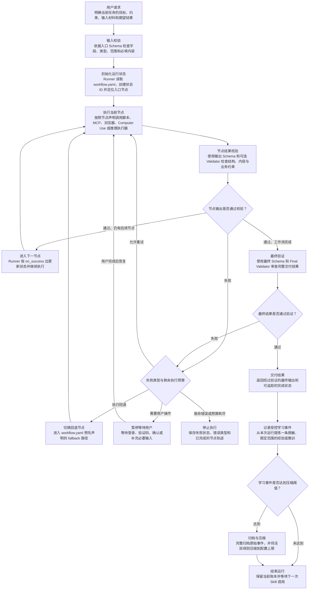

# AIALRA-SKILL-TEMPLATE

一个通用的、可执行的 Agent Skill 仓库模板。它统一每个 Skill 必须遵循的运行协议：

- 图驱动工作流：使用明确的节点和有向边定义执行步骤、先后顺序与状态转换，使每次运行都遵循同一条可检查、可追踪的工作流。
- 结构化输入输出：使用 Schema 约束初始输入、节点输出和最终结果，使 Agent、脚本与外部工具之间通过明确的数据契约协作。
- 确定性执行：将固定、重复、可计算的操作交给参数化脚本执行，并将外部工具调用和语义判断限制在节点声明的范围内。
- 失败回退：为每个节点声明超时、最大重试次数、预定义回退节点、用户等待状态和停止条件，使失败按照受控路径处理。
- 最终验证：在节点执行后校验输出，并在工作流完成前执行最终 Schema 与 Validator 检查，只有通过验证的结果才能交付。
- 受控学习：每次运行后记录一条脱敏、限定范围的经验或教训，定期压缩活跃规则并完整归档原始事件，核心规则只能经过审查、测试和版本变更后更新。
- 独立 Git：每个 Skill 使用独立仓库管理提交历史、版本、测试、发布和回滚，使其能够单独演进并保持可追溯性。

## 核心模型

### 一个 Skill 对应一个独立 Git 仓库

Skill 是围绕一个明确任务领域组织起来的工作流、指令、Schema、脚本、验证器、测试和学习记录。每个 Skill 由本模板生成，并拥有自己的独立 Git 仓库。

采用独立仓库的原因是：

- 变更边界清晰：一个 Skill 的工作流、权限或学习规则发生变化时，不会同时改变其他 Skill。
- 版本独立：每个 Skill 可以按照自身节奏发布版本、创建标签和维护变更记录。
- 测试独立：提交只需要验证当前 Skill 的行为，失败结果和回归范围更容易定位。
- 回滚独立：某个 Skill 出现问题时，可以单独回退到稳定版本，不影响其他 Skill。
- 权限独立：不同 Skill 可以配置不同的维护者、分支保护、外部工具权限和发布策略。
- 历史可追溯：核心规则、实现代码和学习记录保存在同一条版本历史中，能够还原任意版本的完整行为。

一个仓库只包含一个 Skill，可以让触发范围和执行领域保持足够小。Agent 的执行具有概率性；当一个仓库同时承载多个任务领域时，触发判断、工具权限、状态流转和学习规则更容易互相影响。单 Skill 仓库让每次执行只面对一组明确的输入、节点、权限和输出契约。

### Catalog

Catalog 是多个 Skill 的集中注册表，通常保存 Skill 名称、仓库地址、版本、负责人、分类和发现信息。它适合统一浏览、检索、依赖治理和团队级发布管理，也会增加一个共享控制层：Skill 的发现、版本和运行仓库需要共同维护，任何结构变化都可能影响整个集合。

本模板不在单个 Skill 仓库中加入 catalog。当前目标是让每个 Skill 自包含、可独立运行和独立演进。未来需要统一浏览时，可以另建一个轻量外部注册表，仅保存仓库地址、稳定版本和必要的发现信息，不参与 Skill 的具体执行。

### Profile

Profile 是面向某类任务的可复用配置变体，例如研究型、文件生产型或工具操作型 profile。它可以为一组相似 Skill 预设章节、工具策略和操作约定，也会引入额外的继承关系和选择逻辑，使维护者需要同时理解通用模板、profile 和具体 Skill 三层规则。

本模板不设置多 profile。所有 Skill 共享同一套运行协议，具体领域行为直接写入各自的 `workflow.yaml`、Schema、执行器和验证器。这样可以从仓库内容直接确定真实行为，避免通用模板与 profile 之间出现覆盖、冲突或版本漂移。

### Agent

Agent 负责理解用户意图、准备结构化输入、调用当前节点允许的外部工具，以及完成无法脚本化的语义判断。Agent 的输出由模型生成，因此同一请求可能出现不同的推理路径。如果由 Agent 自由决定下一节点，可能产生跳过校验、改变顺序、无限重试、临时选择未声明工具或提前宣布完成等行为，执行结果也难以稳定复现。

### Runner

Runner 是仓库中的确定性状态机程序，对应 `.agents/skills/<skill-name>/scripts/runner.py`。它读取 `workflow.yaml`，为每次运行创建唯一状态，记录当前节点和已完成结果，并根据预先声明的边决定下一步。Runner 负责节点顺序、输入输出校验、超时、重试、回退、用户等待、写操作确认和最终完成条件。

Agent 每次只能处理 Runner 当前返回的节点指令，再把符合 Schema 的结果提交给 Runner。Runner 校验结果后返回下一项允许动作。这个职责边界将概率性的理解与判断限制在节点内部，将流程控制交给可重复执行的程序。

完整运行过程如下：



图中的关键术语：

- `workflow.yaml`：Skill 的工作流定义文件，声明入口节点、节点属性、成功路径、回退路径和全局执行限制。
- Schema：JSON 数据契约，用于限定输入或输出必须包含的字段、类型、取值范围和附加属性。
- Validator：Schema 之外的确定性检查程序，用于验证跨字段关系、业务规则或最终结果质量。
- 状态 ID：一次 Skill 运行的唯一标识，用于保存当前节点、重试次数、确认记录、节点结果和执行轨迹。
- `on_success`：当前节点通过验证后允许进入的下一节点；工作流完成时指向完成状态。
- `fallback`：当前节点重试耗尽或明确要求降级时进入的预定义回退节点。
- 用户等待状态：需要登录、验证码、授权确认或补充输入时使用的暂停状态，用户完成操作后由 Runner 恢复。
- Learning ledger：保存脱敏学习事件的结构化账本；原始事件在压缩前完整归档，活跃规则只保留受限的运行上下文。

## 执行器优先级

1. `script`：固定、重复、可计算的机械操作，由 Runner 直接执行。
2. `mcp`：使用明确工具和参数 Schema，不额外套脆弱脚本。
3. `browser-dom`：API/MCP 不足时使用结构化页面操作。
4. `computer-use`：只有无法结构化操作时使用；登录和验证码由用户完成。
5. `reasoning`：只用于无法脚本化的语义判断，仍必须返回 Schema 合规 JSON。

## 单 Skill 仓库结构

```text
my-skill/
├── .git/
├── .core-lock.json
├── AGENTS.md
├── VERSION
├── .agents/skills/my-skill/
│   ├── SKILL.md
│   ├── workflow.yaml
│   ├── agents/openai.yaml
│   ├── schemas/
│   └── scripts/
│       ├── runner.py
│       ├── runtime_lib.py
│       ├── learn.py
│       ├── compact.py
│       ├── promote.py
│       ├── freeze_core.py
│       └── validate_repo.py
├── learning/
│   ├── ledger.jsonl
│   ├── active-rules.json
│   ├── archive/
│   └── proposals/
├── scripts/
├── tests/
└── .github/workflows/validate.yml
```

领域需要时才添加 `executors/`、`validators/`、`references/` 或 `assets/`，不预先制造空目录和文档。

## 创建独立 Skill 仓库

```bash
python3 scripts/create_skill_repo.py \
  --name shopping-price-research \
  --output ../shopping-price-research \
  --display-name "Shopping Price Research" \
  --short-description "Compare live prices with verified evidence" \
  --description "Research current product offers with direct evidence. Use when the user asks for live price comparison or link verification. Do not use for purchasing actions or historical-price prediction." \
  --default-prompt 'Use $shopping-price-research to compare current offers for this exact product.'
```

生成器会：

- 优先调用 Codex 内置 `skill-creator` 官方初始化器；
- 创建新的独立 Git 仓库；
- 写入统一 Runner、学习系统、安全策略、测试和 CI；
- 生成核心 SHA-256 锁；
- 让工作流保持 `configured=false`，在领域图和回归测试完成前拒绝运行。

## 固化与成长

稳定核心包括工作流、Schema、脚本、验证器、Skill 指令、安全策略和强制执行文件。`.core-lock.json` 记录它们的哈希；任何未登记变更都会让 Runner 硬停止。

每次执行后只记录一条脱敏、限定 scope 的经验或教训。默认累计 32 条时：

- 原始事件完整移动到 `learning/archive/`，不依赖“已经提交到 Git”才保留；
- 重复规则被确定性合并，保留正负计数和事件哈希；
- 活跃规则最多 16 条，即活跃上下文减半；
- 未进入活跃集合的事件仍在归档和 Git 历史中，不丢失；
- 学习规则只能作为 advisory，不能改变流程、权限或安全边界。

晋升到核心只生成 proposal，不自动修改核心。至少需要 3 个独立支持案例，或一次用户确认的严重安全事件，并完成反例审查、回归测试、版本变更、人工批准和重新冻结。

## 验证模板自身

```bash
python3 scripts/validate_template.py
python3 -m unittest discover -s tests -v
python3 scripts/check_secrets.py
```

详细协议见 [docs/architecture.md](docs/architecture.md)，学习机制见 [docs/learning.md](docs/learning.md)，从 v0.1 迁移见 [docs/migration-v0.2.md](docs/migration-v0.2.md)。
