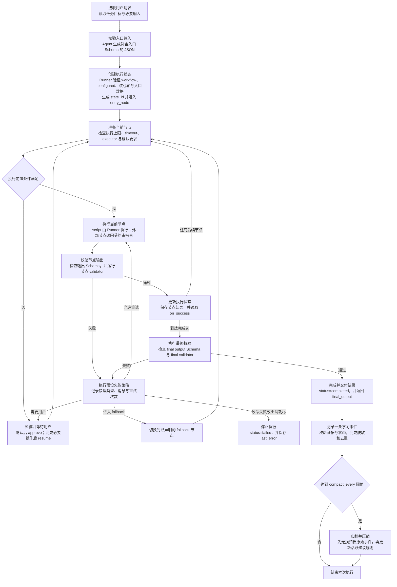

# Skill Runtime 架构

## 文档职责

本文定义通用 Skill Runtime 的组成、执行协议、状态控制、稳定核心和学习边界。

适用对象：

- 模板维护者；
- Runtime 开发者；
- 安全审计者；
- 领域 Skill 设计者。

创建 Skill 的操作步骤由根目录 `README.md` 说明。本文用于 Runtime 设计、修改和审计。

## 架构目标

每个 Skill 仓库包含一个 Skill、一份工作流和一套独立 Git 历史。

Runtime 强制以下规则：

1. `workflow.yaml` 固定执行节点和节点顺序。
2. `runner.py` 独占执行状态和状态转换。
3. Schema 固定每个节点的输入输出结构。
4. validator 执行确定性结果检查。
5. 重试、回退、暂停和停止均由工作流声明。
6. 外部副作用按照声明进入用户确认状态。
7. 运行时学习与稳定核心物理分离。
8. Git 和核心锁记录稳定核心的版本与完整性。

Agent 的职责限定为：生成入口 JSON、执行 Runner 返回的外部动作、提交结构化节点结果、向用户交付已完成结果。

## 核心组件

| 文件或目录 | 职责 | 运行时写入权限 |
|---|---|---:|
| `SKILL.md` | 定义触发条件、适用边界和 Runner 调用协议 | 禁止 |
| `workflow.yaml` | 定义节点、顺序、执行器、重试、回退和停止条件 | 禁止 |
| `schemas/` | 定义节点输入、节点输出和最终输出结构 | 禁止 |
| `executors/` | 保存固定、重复、可计算的领域脚本 | 禁止 |
| `validators/` | 执行节点结果和最终结果检查 | 禁止 |
| `scripts/runner.py` | 保存状态、执行节点、验证结果、控制状态转换 | 禁止 |
| `scripts/runtime_lib.py` | 提供 Schema、路径、工作流和核心锁验证 | 禁止 |
| `.core-lock.json` | 保存稳定核心文件的 SHA-256 清单 | 仅限受审查的核心升级 |
| `learning/ledger.jsonl` | 暂存每次运行产生的一条脱敏事件 | 允许 |
| `learning/archive/` | 无损保存已压缩批次的原始事件 | 允许 |
| `learning/active-rules.json` | 保存数量受限的活跃建议规则 | 允许 |
| `learning/proposals/` | 保存核心晋升候选提案 | 允许 |
| `.runtime/` | 保存运行状态和节点临时输入输出 | 允许，不进入 Git |

`executors/`、`validators/`、`references/` 和 `assets/` 按领域工作流需求创建。无对应实现时不创建空目录。

## 执行协议



Runner 是当前节点和执行状态的唯一写入者。Agent 禁止直接编辑状态文件、跳转节点或伪造完成状态。

## 工作流 IR

`workflow.yaml` 是执行事实来源。文件采用兼容 JSON 的 YAML 格式，由 Python 标准库 JSON 解析器读取。

顶层契约：

```json
{
  "ir_version": 1,
  "skill_name": "example-skill",
  "configured": true,
  "entry_node": "normalize-input",
  "limits": {
    "max_nodes": 16,
    "total_timeout_seconds": 1800
  },
  "learning": {
    "compact_every": 32,
    "active_rule_limit": 16
  },
  "nodes": [],
  "final_output_schema": "schemas/final.schema.json",
  "final_validator": null
}
```

每个节点必须声明：

- 唯一节点 ID；
- 输入 Schema；
- 输出 Schema；
- 一个执行器；
- 精确脚本 argv 或外部动作契约；
- 副作用类别；
- 用户确认要求；
- 超时时间；
- 最大重试次数；
- 可选 validator；
- `on_success` 节点；
- 可选 `fallback` 节点；
- 停止条件。

所有节点必须从入口节点可达。成功边和回退边禁止形成环路。重复执行必须使用 `max_retries` 限定次数。

文本停止条件属于外部执行协议。机器可判定的停止条件必须写入 Schema 或 validator。

## 执行器选择

执行器按照以下优先级设计：

1. `script`：固定、重复、可计算的操作，由 Runner 直接执行。
2. `mcp`：具有固定工具名称和结构化参数的外部能力。
3. `browser-dom`：通过结构化页面元素完成的界面操作。
4. `computer-use`：无法通过结构化接口完成的界面操作；身份验证步骤由用户完成。
5. `reasoning`：需要语义判断的操作；输出必须符合节点 Schema。

每个节点固定一种执行器。Runtime 执行期间禁止替换节点执行器。

## 状态控制

| 状态 | 含义 | 合法操作 |
|---|---|---|
| `running` | 当前节点可以执行 | `advance` |
| `waiting-confirmation` | 当前节点等待用户确认副作用 | 用户确认后执行 `approve` |
| `waiting-external` | 当前节点等待外部执行器结果 | 执行声明动作后执行 `submit` 或 `fail` |
| `waiting-user` | 当前节点等待用户完成必要操作 | 用户完成后执行 `resume` |
| `completed` | 最终结果已通过全部验证 | 交付结果并记录学习事件 |
| `failed` | 致命失败或重试耗尽 | 停止执行 |

脚本节点使用 argv 数组和 `shell=false`。外部节点必须执行 Runner 返回的动作，并提交符合输出 Schema 的 JSON。

## 失败处理

- **重试**：同一节点在 `max_retries` 范围内重新执行。
- **fallback**：当前节点失败后进入已声明的替代节点。
- **等待用户**：状态暂停，用户完成必要操作后恢复。
- **停止**：安全条件触发、致命错误发生或重试耗尽，状态进入 `failed`。

所有失败路径必须产生结构化错误状态。失败状态禁止转换为完成状态。

## 稳定核心与学习边界

稳定核心包括：

- `workflow.yaml`；
- Schema；
- executor 和 validator；
- `SKILL.md`；
- 权限、确认和停止规则；
- Runtime 脚本；
- 强制验证与安全配置。

运行时学习禁止写入稳定核心。每个完成或用户暂停的状态最多产生一条脱敏学习事件。

达到默认的 32 条事件阈值后：

1. 原始事件完整写入按内容寻址的归档；
2. 归档成功后截断活跃账本；
3. 规范化后相同的经验进行确定性合并；
4. 活跃建议规则限制为最多 16 条；
5. 完整原始信息保存在归档中；提交学习变更后进入 Git 历史。

活跃建议规则禁止改变节点顺序、权限、确认要求、validator 和停止条件。核心晋升必须经过提案、反例审查、回归测试、版本升级、人工批准和核心锁重建。

## 核心锁

`.core-lock.json` 记录稳定核心文件的 SHA-256 哈希。Runner 在开始和恢复执行前验证清单。任何差异触发硬停止。

核心锁提供完整性漂移检测。身份认证、恶意写入防护和来源证明由 Git 历史、仓库权限、受保护分支、固定依赖的 CI 和签名发布承担。

Runner 的确认状态负责阻止自动继续。宿主和 Agent 必须在取得用户真实确认后调用 `approve`。

## 初始草稿状态

新生成仓库包含以下配置：

```json
"configured": false
```

该状态表示领域工作流尚未完成。Runner 必须拒绝执行。

切换为 `true` 前必须完成：

1. 定义最小支持范围和排除范围；
2. 定义全部节点和执行器；
3. 定义全部输入输出 Schema；
4. 添加成功、失败和相邻非触发测试；
5. 完成安全审查；
6. 重建并验证核心锁。

## 架构审计要求

审计必须验证：

- 每条强制规则具有对应代码实现；
- Agent 无法通过 Runner 命令跳过节点或 validator；
- 外部写入和破坏性操作进入确认状态；
- 重试、fallback 和总执行时间均具有上限；
- 学习脚本的写入范围限定为 `learning/`；
- 原始事件在账本截断前完成归档；
- 稳定核心变更触发核心锁不匹配；
- 每项安全承诺具有对应失败路径测试。

依赖 Agent 遵循的规则必须标记为协议约束。由代码强制执行的规则必须具有验证器和回归测试。
