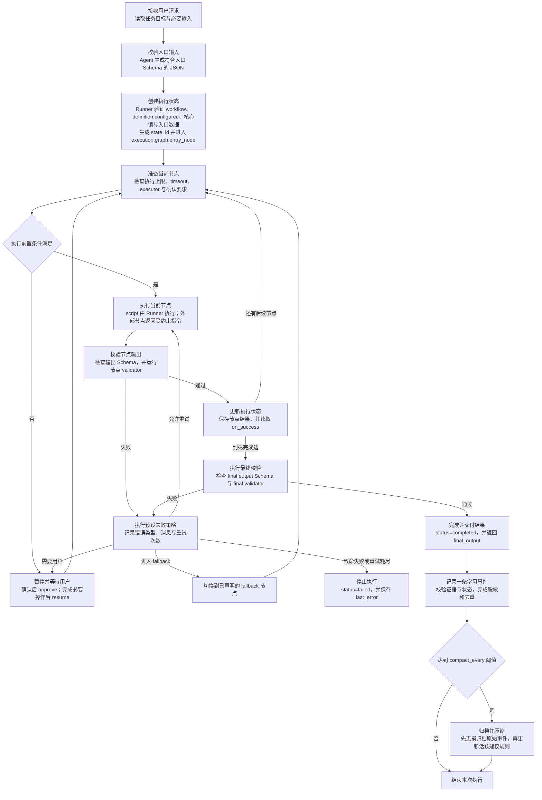

# Skill Runtime 架构

## 文档职责

本文定义通用 Skill Runtime 的组成、执行协议、状态控制、稳定核心和学习边界。

适用对象：

- 模板维护者；
- Runtime 开发者；
- 安全审计者；
- 领域 Skill 设计者。

创建 Skill 的操作步骤由根目录 `README.md` 说明。本文用于 Runtime 设计、修改和审计。

## 架构目标

每个 Skill 仓库包含一个 Skill、一份工作流和一套独立 Git 历史。

Runtime 强制以下规则：

1. `workflow.yaml` 固定执行节点和节点顺序。
2. `runner.py` 独占执行状态和状态转换。
3. Schema 固定每个节点的输入输出结构。
4. validator 执行确定性结果检查。
5. 重试、回退、暂停和停止均由工作流声明。
6. 外部副作用按照声明进入用户确认状态。
7. 运行时学习与稳定核心物理分离。
8. Git 和核心锁记录稳定核心的版本与完整性。

Agent 的职责限定为：生成入口 JSON、执行 Runner 返回的外部动作、提交结构化节点结果、向用户交付已完成结果。

## 核心组件

| 文件或目录 | 职责 | 运行时写入权限 |
|---|---|---:|
| `SKILL.md` | 定义触发条件、适用边界和 Runner 调用协议 | 禁止 |
| `workflow.yaml` | 定义节点、顺序、执行器、重试、回退和停止条件 | 禁止 |
| `schemas/` | 定义节点输入、节点输出和最终输出结构 | 禁止 |
| `executors/` | 保存固定、重复、可计算的领域脚本 | 禁止 |
| `validators/` | 执行节点结果和最终结果检查 | 禁止 |
| `scripts/runner.py` | 保存状态、执行节点、验证结果、控制状态转换 | 禁止 |
| `scripts/runtime_lib.py` | 提供 Schema、路径、工作流和核心锁验证 | 禁止 |
| `.core-lock.json` | 保存稳定核心文件的 SHA-256 清单 | 仅限受审查的核心升级 |
| `learning/ledger.jsonl` | 暂存每次运行产生的一条脱敏事件 | 允许 |
| `learning/archive/` | 无损保存已压缩批次的原始事件 | 允许 |
| `learning/active-rules.json` | 保存数量受限的活跃建议规则 | 允许 |
| `learning/proposals/` | 保存核心晋升候选提案 | 允许 |
| `.runtime/` | 保存运行状态和节点临时输入输出 | 允许，不进入 Git |

`executors/`、`validators/`、`references/` 和 `assets/` 按领域工作流需求创建。无对应实现时不创建空目录。

## 执行协议



Runner 是当前节点和执行状态的唯一写入者。Agent 禁止直接编辑状态文件、跳转节点或伪造完成状态。

## 工作流 IR

`workflow.yaml` 是执行事实来源。文件采用兼容 JSON 的 YAML 格式，由 Python 标准库 JSON 解析器读取。

顶层固定为 `definition`、`execution`、`learning` 三个大类。配置条目必须位于对应分类的二级或三级结构中。顶层散项、未知分类和未知字段均由验证器拒绝。

以下代码块采用 `jsonc` 语法。`//` 注释仅用于解释字段；实际 `workflow.yaml` 必须删除全部注释，并保持可被标准 JSON 解析器读取。

```jsonc
{
  "definition": { // 工作流身份、协议版本和配置状态。
    "ir_version": 2, // 工作流 IR 协议版本；当前仅接受 2，不兼容变更必须升级版本。
    "skill_name": "example-skill", // Skill 稳定标识符；必须与 .agents/skills/ 下的目录名一致。
    "configured": true // 配置状态；false 为不可执行草稿，true 表示领域配置和验证已经完成。
  },
  "execution": { // 单次运行的资源、图和完成校验分类。
    "limits": { // 单次执行的全局资源边界。
      "max_nodes": 16, // 允许成功完成的最大节点数量，取值范围为 1–64。
      "total_timeout_seconds": 1800 // 从 started_at 计算的总时长上限，单位为秒，取值范围为 1–86400。
    },
    "graph": { // 工作流入口与节点集合。
      "entry_node": "normalize-input", // 入口节点 ID；必须存在于 nodes 数组中。
      "nodes": [] // 工作流节点数组；实际文件至少包含一个完整节点，此处空数组仅表示分类契约。
    },
    "completion": { // 工作流到达完成边后的最终校验。
      "output_schema": "schemas/final.schema.json", // 最终输出 Schema 的安全相对路径。
      "validator": null // 最终 validator 的 argv 数组；null 表示仅执行最终 Schema 验证。
    }
  },
  "learning": { // 受控学习配置。
    "compaction": { // 学习事件归档和活跃规则压缩配置。
      "compact_every": 32, // 触发压缩的事件数量，取值范围为 4–1000。
      "active_rule_limit": 16 // 活跃建议规则上限，取值范围为 1–500，且不得超过 compact_every 的一半。
    }
  }
}
```

每个节点必须声明：

- 唯一节点 ID：`id` 使用小写 kebab-case 标识节点，并在当前工作流中保持唯一。
- 输入 Schema：`input_schema` 指向节点接收数据的 Schema 文件，并在节点执行前约束输入结构。
- 输出 Schema：`output_schema` 指向节点产出数据的 Schema 文件，并在状态转换前约束输出结构。
- 一个执行器：`executor` 固定为 `script`、`mcp`、`browser-dom`、`computer-use` 或 `reasoning` 中的一种。
- 精确脚本 argv 或外部动作契约：脚本节点使用 `command` argv 数组，外部节点使用包含动作名称和参数的 `action` 对象。
- 副作用类别：`side_effect` 声明节点属于 `none`、`read`、`write` 或 `destructive`。
- 用户确认要求：`requires_confirmation` 明确节点执行前是否必须取得用户确认，写入和破坏性节点必须设为 `true`。
- 超时时间：`timeout_seconds` 限定单次节点执行可以占用的最长时间。
- 最大重试次数：`max_retries` 限定节点失败后允许重新执行的次数。
- 可选 validator：`validator` 保存确定性校验程序的 argv 数组，不需要额外校验时声明为 `null`。
- `on_success` 节点：`on_success` 指定当前输出通过全部校验后进入的节点或完成边 `__complete__`。
- 可选 `fallback` 节点：`fallback` 指定重试结束后进入的替代节点，不设置回退路径时声明为 `null`。
- 停止条件：`stop_conditions` 使用字符串数组列出必须暂停或终止当前节点的条件，没有附加条件时使用空数组。

### 副作用类别

`side_effect` 表示节点会对工作流之外的数据或系统产生哪类影响，Runner 使用该值检查节点是否需要用户确认。

| 取值 | 一句话解释 |
|---|---|
| `none` | 节点只处理已经提供的输入，不读取或改变工作流之外的数据和系统状态。 |
| `read` | 节点读取工作流之外的现有数据，同时保持外部数据和系统状态不变。 |
| `write` | 节点创建或更新工作流之外的数据，执行前必须取得用户确认。 |
| `destructive` | 节点删除、覆盖、撤销或执行其他难以恢复的外部变更，执行前必须取得用户确认。 |

### `command` 与 argv 数组

argv 是 argument vector 的缩写，表示传给程序的一组命令行参数。`command` 使用 JSON 数组保存 argv，数组中的每个字符串都是一个独立参数。

```json
{
  "command": [
    "python3",
    "executors/process.py",
    "--input",
    "${input_file}",
    "--output",
    "${output_file}"
  ]
}
```

该数组从上到下表示：启动 `python3`，运行 `executors/process.py`，把 Runner 创建的输入文件路径传给 `--input`，再把节点应当写入的输出文件路径传给 `--output`。Runner 在执行前将 `${input_file}` 和 `${output_file}` 替换成当前运行的真实路径。

argv 数组明确保存每个参数的边界。参数中包含空格时仍然只占一个数组元素，Runner 可以逐项验证参数，日志也能准确还原实际执行内容。

`shell=false` 表示 Runner 直接启动 argv 中指定的程序，不把命令交给 Bash、Zsh 等命令解释器。管道符 `|`、重定向符 `>`、通配符 `*` 和命令替换符 `$()` 不会被 Shell 自动解释，从而减少命令拼接和输入注入风险，并让不同运行环境采用一致的参数边界。

### `stop_conditions`

`stop_conditions` 保存外部执行器在执行当前节点时必须检查的文字条件。一个节点可能同时具有多个独立停止原因，因此该字段使用数组保存，每个数组元素只描述一个原因，空数组表示没有附加的文字停止条件。

```json
{
  "stop_conditions": [
    "无法访问必需数据源时停止。",
    "出现身份验证要求时报告 user-required。"
  ]
}
```

停止条件分为以下两层：

| 层级 | 保存位置 | 谁检查 | 触发后的结果 |
|---|---|---|---|
| 外部执行协议 | `stop_conditions` 字符串数组 | Agent 或外部执行器读取文字并判断当前现场是否符合条件 | 调用 `fail` 报告 `user-required`、`fallback` 或 `fatal`，由 Runner 更新状态。 |
| 机器强制规则 | Schema、validator、超时、重试上限和确认关卡 | Runner 通过代码执行确定性检查 | 检查不通过时拒绝节点输出、重试、回退、等待用户或停止工作流。 |

Runner 不解析 `stop_conditions` 文字，也不根据字符串自动跳转节点。能够由程序确定的停止规则必须写入 Schema、validator 或 Runtime 检查，确保其可以被稳定执行和测试。

所有节点必须从入口节点可达。成功边和回退边禁止形成环路。重复执行必须使用 `max_retries` 限定次数。

## 执行器选择

外部执行器是运行在 Runner 进程之外的能力，包括 `mcp`、`browser-dom`、`computer-use` 和 `reasoning`。Runner 负责选择当前节点、返回已声明的动作并校验结果；Agent 或宿主负责调用指定的外部能力，并把执行结果交回 Runner。`script` 节点由 Runner 自己启动，因此不属于外部节点。

执行器按照以下优先级设计：

1. `script`：固定、重复、可计算的操作，由 Runner 直接执行。
2. `mcp`：具有固定工具名称和结构化参数的外部能力。
3. `browser-dom`：通过结构化页面元素完成的界面操作。
4. `computer-use`：无法通过结构化接口完成的界面操作；身份验证步骤由用户完成。
5. `reasoning`：需要语义判断的操作；输出必须符合节点 Schema。

每个节点固定一种执行器。Runtime 执行期间禁止替换节点执行器。

## 状态控制

表中的命令是 Runner 的状态转换命令，通常由 Agent 或宿主调用。命令只在对应状态下有效，Runner 会拒绝不符合当前状态的调用。

| 状态 | 当前到底发生了什么 | 下一条 Runner 命令 | 命令会做什么 |
|---|---|---|---|
| `running` | 当前节点的前置条件已经满足，节点尚未完成，Runner 允许继续推进。 | `advance` | 请求 Runner 推进当前节点；脚本节点会立即执行，外部节点会返回动作并进入等待结果状态。 |
| `waiting-confirmation` | 当前节点会写入或破坏外部状态，Runner 已暂停并等待用户明确同意。 | `approve` | 记录用户对当前节点的确认，再把状态恢复为 `running`。 |
| `waiting-external` | Runner 已返回外部动作，当前正在等待该动作的结果或失败报告。 | `submit` 或 `fail` | `submit` 提交候选输出供 Runner 校验，`fail` 报告外部动作没有产生可接受结果。 |
| `waiting-user` | 外部执行器报告必须由用户亲自完成登录、验证或补充输入，Runner 已暂停。 | `resume` | 用户完成必要操作后恢复当前节点，Runner 重新进入 `running`。 |
| `completed` | 最终输出已经通过节点校验和最终校验，工作流已经结束。 | 无 | 交付 `final_output`，并按规则记录一次脱敏学习事件。 |
| `failed` | 致命错误发生或允许的重试与回退路径已经耗尽，工作流已经结束。 | 无 | 保留 `last_error` 和执行轨迹，停止后续节点。 |

### 外部节点如何执行和回报

Runner 进入外部节点时会返回一份结构化指令。以下示例表示：当前状态正在等待 MCP 执行器调用 `records.lookup`，随后返回符合指定输出 Schema 的结果。

```json
{
  "state_id": "example-state-id",
  "status": "waiting-external",
  "node": {
    "id": "lookup-record",
    "executor": "mcp",
    "action": {
      "name": "records.lookup",
      "arguments": {
        "query": "example"
      }
    },
    "output_schema": "schemas/lookup-output.schema.json"
  }
}
```

“执行 Runner 返回的动作”表示 Agent 或宿主只调用 `node.executor` 指定的执行器和 `node.action` 指定的动作，不临时替换工具、动作名称或参数范围。

外部动作成功产生结果后，Agent 将结果保存为 JSON 文件。该 JSON 的字段和类型必须符合 `node.output_schema` 指向的 Schema。

例如，输出 Schema 要求顶层包含一个 `records` 数组时，`output.json` 可以写成：

```json
{
  "records": []
}
```

保存文件后调用：

```bash
python3 scripts/runner.py submit \
  --state-id "example-state-id" \
  --node-id "lookup-record" \
  --output "output.json"
```

`submit` 表示“这是外部动作产生的候选输出，请 Runner 校验”。Runner 仍会检查输出 Schema、validator 和后续完成条件；提交动作本身不会绕过校验或直接宣布完成。

外部动作没有产生可接受结果时，Agent 调用 `fail` 并报告失败类型和原因：

```bash
python3 scripts/runner.py fail \
  --state-id "example-state-id" \
  --node-id "lookup-record" \
  --kind "retryable" \
  --message "声明的外部动作没有返回可用结果。"
```

| `fail --kind` 取值 | 含义 | Runner 的处理 |
|---|---|---|
| `retryable` | 当前失败可能通过再次执行同一节点解决。 | 在 `max_retries` 范围内重试，次数耗尽后使用已声明的 fallback 或进入 `failed`。 |
| `fallback` | 当前动作不适合继续执行，需要使用预先声明的替代节点。 | 进入 `fallback` 指定的节点；未声明 fallback 时进入 `failed`。 |
| `user-required` | 当前动作必须等待用户亲自完成必要操作。 | 进入 `waiting-user`，等待用户完成后调用 `resume`。 |
| `fatal` | 当前错误不允许继续执行。 | 立即进入 `failed` 并保存错误信息。 |

`submit` 用于交付候选结果，`fail` 用于报告无法交付合格结果。两条命令都由 Runner 根据既定工作流决定下一状态。

## 失败处理

- **重试**：同一节点在 `max_retries` 范围内重新执行。
- **fallback**：当前节点失败后进入已声明的替代节点。
- **等待用户**：状态暂停，用户完成必要操作后恢复。
- **停止**：安全条件触发、致命错误发生或重试耗尽，状态进入 `failed`。

所有失败路径必须产生结构化错误状态。失败状态禁止转换为完成状态。

## 稳定核心与学习边界

稳定核心包括：

- `workflow.yaml`；
- Schema；
- executor 和 validator；
- `SKILL.md`；
- 权限、确认和停止规则；
- Runtime 脚本；
- 强制验证与安全配置。

运行时学习禁止写入稳定核心。每个完成或用户暂停的状态最多产生一条脱敏学习事件。

达到默认的 32 条事件阈值后：

1. 原始事件完整写入按内容寻址的归档；
2. 归档成功后截断活跃账本；
3. 规范化后相同的经验进行确定性合并；
4. 活跃建议规则限制为最多 16 条；
5. 完整原始信息保存在归档中；提交学习变更后进入 Git 历史。

活跃建议规则禁止改变节点顺序、权限、确认要求、validator 和停止条件。核心晋升必须经过提案、反例审查、回归测试、版本升级、人工批准和核心锁重建。

## 核心锁

`.core-lock.json` 记录稳定核心文件的 SHA-256 哈希。Runner 在开始和恢复执行前验证清单。任何差异触发硬停止。

核心锁提供完整性漂移检测。身份认证、恶意写入防护和来源证明由 Git 历史、仓库权限、受保护分支、固定依赖的 CI 和签名发布承担。

Runner 的确认状态负责阻止自动继续。宿主和 Agent 必须在取得用户真实确认后调用 `approve`。

## 初始草稿状态

新生成仓库包含以下配置：

```json
{
  "definition": {
    "configured": false
  }
}
```

该状态表示领域工作流尚未完成。Runner 必须拒绝执行。

切换为 `true` 前必须完成：

1. 定义最小支持范围和排除范围；
2. 定义全部节点和执行器；
3. 定义全部输入输出 Schema；
4. 添加成功、失败和相邻非触发测试；
5. 完成安全审查；
6. 重建并验证核心锁。

## 架构审计要求

审计必须验证：

- 每条强制规则具有对应代码实现；
- Agent 无法通过 Runner 命令跳过节点或 validator；
- 外部写入和破坏性操作进入确认状态；
- 重试、fallback 和总执行时间均具有上限；
- 学习脚本的写入范围限定为 `learning/`；
- 原始事件在账本截断前完成归档；
- 稳定核心变更触发核心锁不匹配；
- 每项安全承诺具有对应失败路径测试。

依赖 Agent 遵循的规则必须标记为协议约束。由代码强制执行的规则必须具有验证器和回归测试。
