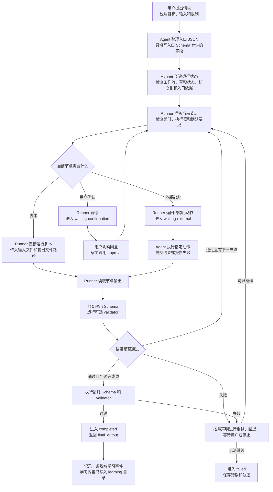

# Skill Runtime 架构入门

## 这份文件能帮你做什么

这份文件回答一个问题：用户提出请求后，Skill 怎样一步一步得到经过检查的结果；

适合阅读这份文件的人：

- 第一次理解 Skill 运行过程的人；
- 准备设计工作流的人；
- 准备审计运行边界的人；

读完以后，你应该能够说清 Agent、Runner、节点和验证器各自负责什么；

如果你已经理解整体流程，只想查询字段和命令，可以直接阅读 [Workflow 精确参考](workflow-reference.md)；

## 先记住三个角色

一次 Skill 运行包含三个主要角色；

### 用户

用户提出目标、提供必要材料，并决定是否批准外部写入；

登录、验证码、扫码和双重认证也由用户亲自完成；

### Agent

Agent 理解用户的自然语言，并把请求整理成结构化输入；

遇到外部节点时，Agent 调用 Runner 指定的工具或界面能力，再把结果交回 Runner；

Agent 可以完成语义判断；它不能改变节点顺序、绕过验证或自行宣布完成；

### Runner

Runner 是一个确定性状态机程序；对应文件为 `.agents/skills/<skill-name>/scripts/runner.py`；

Runner 保存当前节点、执行状态、重试次数、用户确认和节点结果；

Runner 决定下一步允许做什么，并拒绝不符合当前状态的命令；

## 为什么需要 Runner

Agent 擅长理解语言和处理不规则情况；同一请求可能产生不同推理过程；

运行顺序、安全确认、超时和完成条件需要稳定执行；Runner 把这些规则写成可测试程序；

职责分开后：

- Agent 负责理解和外部操作；
- Runner 负责顺序和状态；
- Schema 负责数据结构；
- validator 负责额外的确定性检查；

## 一次请求怎样运行

先看完整流程；后面会逐步解释每一部分；

## 第一步：Agent 准备入口数据

用户通常使用自然语言提出请求；Runner 只接收 JSON；

Agent 先读取入口节点指定的输入 Schema，再把用户请求转换成符合该 Schema 的最小 JSON；

Schema 是一份数据结构规则；它可以规定必填字段、字段类型、长度和允许值；

入口 JSON 不符合 Schema 时，Runner 拒绝启动，并返回具体字段错误；

## 第二步：Runner 创建状态

Runner 为每次运行创建唯一 `state_id`；

状态文件会记录：

- 当前节点；
- 当前状态；
- 已完成节点的结果；
- 重试次数；
- 已确认节点；
- 最后一次错误；
- 执行轨迹；

Agent 不能直接编辑状态文件；所有状态变化都要通过 Runner 命令完成；

## 第三步：Runner 准备节点

节点是工作流中的一个执行步骤；

每个节点会声明：

- 接收什么输入；
- 产生什么输出；
- 使用什么执行器；
- 是否读取或改变外部状态；
- 是否需要用户确认；
- 最长执行时间；
- 失败后可以重试几次；
- 成功后进入哪里；
- 失败后是否进入回退节点；

字段名称、允许值和完整示例位于 [Workflow 精确参考](workflow-reference.md)；

## 第四步：执行当前节点

节点分成脚本节点和外部节点；

### 脚本节点

脚本节点用于固定、重复和可以计算的操作；

Runner 直接启动脚本，并提供输入文件和输出文件路径；脚本完成后把 JSON 写入指定输出文件；

脚本启动失败、超时或没有产生输出文件时，Runner 按照节点失败规则处理；

### 外部节点

外部节点使用 Runner 进程之外的能力；包括 MCP、浏览器 DOM、Computer Use 和 reasoning；

Runner 返回当前节点已经声明的执行器、动作、参数和输出 Schema；

Agent 或宿主执行该动作；成功时调用 `submit` 提交候选 JSON，失败时调用 `fail` 报告原因；

Runner 收到结果后仍会执行 Schema 和 validator 检查；

## 第五步：检查节点结果

每个节点输出都先经过输出 Schema；

Schema 适合检查字段是否存在、类型是否正确、数量是否超限；

validator 是额外的确定性检查程序；它适合检查跨字段关系和 Schema 无法表达的规则；

任何一项检查失败时，结果不会进入下一节点；

## 第六步：决定下一状态

Runner 只允许工作流中已经声明的状态转换；

常见状态包括：

| 状态 | 人话含义 |
|---|---|
| `running` | 当前节点已经具备推进条件； |
| `waiting-confirmation` | 当前节点正在等待用户确认； |
| `waiting-external` | Runner 已返回外部动作，正在等待结果； |
| `waiting-user` | 当前流程正在等待用户亲自完成必要操作； |
| `completed` | 最终结果已经通过全部检查； |
| `failed` | 工作流已经失败并停止； |

每个状态允许的命令和命令效果位于 [Workflow 精确参考](workflow-reference.md)；

## 失败后会发生什么

节点失败后，Runner 根据声明选择一种结果；

### 重试

当前节点在 `max_retries` 范围内重新执行；

重试次数耗尽后，Runner 进入回退节点或失败状态；

### 回退

Runner 进入节点预先声明的 `fallback`；

回退节点必须存在，并且不能直接伪造完成结果；

### 等待用户

外部动作需要登录、验证码或必要输入时，Runner 进入 `waiting-user`；

用户完成操作后，宿主调用 `resume`；

### 停止

致命错误、预算耗尽或安全条件触发时，Runner 进入 `failed`；

失败状态保存错误和轨迹，并停止后续节点；

## 写入为什么需要确认

节点通过 `side_effect` 声明副作用；

`write` 表示创建或更新外部数据；`destructive` 表示删除、覆盖、撤销或其他难以恢复的操作；

这两类节点必须把 `requires_confirmation` 设为 `true`；

Runner 在执行前进入 `waiting-confirmation`；宿主取得用户真实同意后才能调用 `approve`；

## 最终结果怎样完成

节点的 `on_success` 指向 `__complete__` 时，Runner 开始最终验证；

最终输出需要通过最终 Schema 和可选 final validator；

全部通过后，状态变为 `completed`，Runner 返回 `final_output`；

任何检查失败时，工作流按照失败规则继续处理；

## 什么是稳定核心

稳定核心保存 Skill 的固定行为；

它包括：

- `workflow.yaml`；
- Schema；
- executor 和 validator；
- `SKILL.md`；
- Runtime 脚本；
- 权限、确认和停止规则；
- 强制安全配置；

`.core-lock.json` 保存这些文件的 SHA-256 清单；内容发生未登记变化时，Runner 硬停止；

经过审查的核心修改需要更新版本、运行测试并重新生成核心锁；

## 学习为什么不能直接修改核心

运行经验可能来自偶然情况，也可能包含不可信输入；

学习系统只把脱敏经验写入 `learning/`；活跃规则只提供建议；

学习规则进入稳定核心前，需要提案、反例审查、测试、版本变更、人工批准和新的核心锁；

完整过程由 [受控学习](learning.md) 逐步解释；

## 接下来读什么

| 你的目标 | 下一份文档 |
|---|---|
| 填写工作流字段 | [Workflow 精确参考](workflow-reference.md) |
| 查找文件职责 | [文件地图](file-map.md) |
| 理解学习记录和晋升 | [受控学习](learning.md) |
| 修改或发布版本 | [版本与维护](maintenance.md) |
| 审查安全边界 | [安全策略](../SECURITY.md) |

读者能够独立复述“用户提出请求、Agent 准备数据、Runner 控制节点、检查通过后完成”时，本页目标已经达成；
