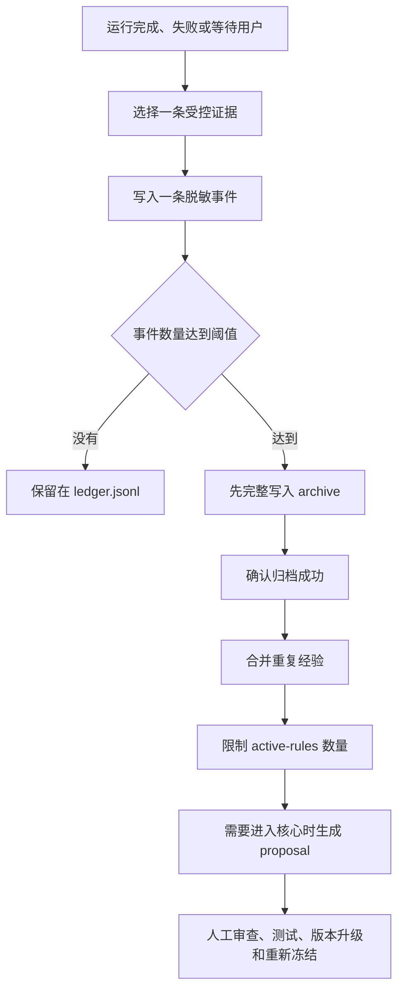

# 受控学习

## 这份文件能帮你做什么

这份文件回答一个问题：Skill 怎样保存运行经验，同时保持稳定核心不被自动改变；

适合阅读这份文件的人：

- 准备启用学习记录的人；
- 准备审查压缩和归档的人；
- 准备把经验晋升到稳定核心的人；

读完以后，你应该能够区分原始事件、活跃规则和稳定核心；

如果你只想运行 Skill，可以暂时跳过这份文件；

## 先看一次完整过程

一次运行结束或暂停后，学习系统最多记录一条脱敏经验；

事件先进入活跃账本；累计达到阈值后，原始事件完整进入归档；重复经验被合并成数量受限的活跃建议规则；

活跃规则只提供建议；进入稳定核心需要单独提案和人工审查；



## 三层数据分别是什么

### 稳定核心

稳定核心保存工作流、Schema、脚本、validator、指令、权限和核心锁；

这些内容决定 Skill 的固定行为；Runtime 学习不能写入这一层；

### 活跃建议规则

活跃建议规则保存在 `learning/active-rules.json`；

Runner 会把有限数量的规则作为 advisory 建议提供给当前节点；

用户当前指令和稳定核心始终具有更高优先级；

### 原始事件历史

尚未压缩的事件保存在 `learning/ledger.jsonl`；

完成压缩的原始事件保存在 `learning/archive/`；

原始事件用于保留证据和恢复历史；

## 一条学习事件长什么样

事件使用一行一个 JSON 对象的 JSONL 格式；

示意结构：

```json
{
  "event_id": "example-event-id",
  "state_id": "example-state-id",
  "polarity": "positive",
  "scope": "result-validation",
  "lesson": "在返回结果前检查必填字段；",
  "evidence": "validator:required-fields",
  "source_hash": "example-source-hash",
  "created_at": "2026-07-21T00:00:00+00:00",
  "promoted": false
}
```

示例值只说明结构；真实事件 ID、状态 ID、哈希和时间由程序生成；

## 每个字段有什么用

| 字段 | 用途 |
|---|---|
| `event_id` | 唯一标识当前学习事件； |
| `state_id` | 连接产生该经验的运行状态； |
| `polarity` | 表示正面经验或负面教训； |
| `scope` | 使用 kebab-case 限定经验适用范围； |
| `lesson` | 保存一条已经脱敏的短经验； |
| `evidence` | 标明经验来自哪类受控证据； |
| `source_hash` | 帮助识别重复来源； |
| `created_at` | 保存创建时间； |
| `promoted` | 标记经验是否已经进入受审查流程； |

同一个 `state_id` 最多只能对应一条学习事件；

## 哪些证据可以使用

允许的证据前缀：

| 前缀 | 含义 |
|---|---|
| `validator:` | 来自确定性 validator 的结果； |
| `executor:` | 来自受控 executor 的执行结果； |
| `review:` | 来自明确的人工或测试审查； |
| `user-confirmed:` | 来自用户明确确认的事实； |

原始提示词、页面指令和完整工具输出不能直接成为学习内容；

## 脱敏会处理什么

学习命令会处理：

- 凭据模式；
- 电子邮箱；
- URL；
- 长数字标识符；
- 过长文本；

最终 `lesson` 长度限制为 12 到 240 个字符；

脱敏后仍包含个人信息或业务秘密时，停止记录并人工检查；

## 怎样记录一条事件

运行已经结束或进入用户暂停状态后，执行：

```bash
python3 .agents/skills/<skill-name>/scripts/learn.py record \
  --state-id "真实状态编号" \
  --polarity "positive" \
  --scope "result-validation" \
  --lesson "在返回结果前检查必填字段；" \
  --evidence "validator:required-fields"
```

`<skill-name>` 需要替换成真实 Skill 名称；

成功时返回 `recorded=true`；同一状态已经记录过事件时，程序拒绝第二条不同经验；

## 为什么需要归档和压缩

原始事件必须完整保留；Runner 每次加载的活跃规则需要保持有限；

Runtime 将存储历史和活跃上下文分开；

默认累计 32 条事件后开始压缩；活跃规则默认最多保留 16 条；

## 压缩按照什么顺序执行

压缩顺序固定：

1. 读取当前账本；
2. 根据内容生成归档哈希；
3. 将原始事件完整写入 `learning/archive/`；
4. 确认归档内容写入成功；
5. 合并规范化后完全相同的经验；
6. 保留正负支持计数和来源事件 ID；
7. 按支持度排序；
8. 截取到活跃规则上限；
9. 更新 `active-rules.json`；
10. 从活跃账本移除已经归档的事件；

归档写入失败时，活跃账本保持不变；

归档哈希冲突或归档被修改时，压缩硬失败；

排他锁会阻止两次压缩同时修改同一批数据；

## 活跃规则长什么样

每条规则保存：

- 稳定 `rule_id`；
- 适用范围；
- 经验正文；
- 规范化文本；
- 正面和负面计数；
- 来源事件摘要；
- 最近出现时间；
- advisory 状态；

未进入活跃集合的事件仍然完整保存在归档和 Git 历史中；

## 怎样生成晋升提案

`promote.py` 只生成提案文件；它不能修改稳定核心；

正常规则至少需要三条支持事件；

单次严重安全事件只有经过用户明确确认后才能生成提案；

```bash
python3 .agents/skills/<skill-name>/scripts/promote.py propose \
  --rule-id "真实规则编号"
```

成功时，提案进入 `learning/proposals/`；

## 提案怎样进入稳定核心

每份新提案默认包含尚未完成的关卡：

1. 反例审查；
2. 回归测试；
3. 工作流和核心测试；
4. 版本升级；
5. 人工批准；
6. 重新生成核心锁；

全部关卡完成后，维护者在另一次经过审查的修改中更新稳定核心；

## 人工审计问题

审核学习变更时回答：

1. 每个状态是否最多记录一条事件；
2. 事件是否来自受控证据；
3. 经验是否完成脱敏；
4. 原始事件是否在账本截断前完整归档；
5. 活跃规则数量是否处于上限内；
6. 学习脚本是否只写入 `learning/`；
7. 晋升是否只生成提案；

任一问题无法明确回答时，学习变更不能进入稳定版本；
